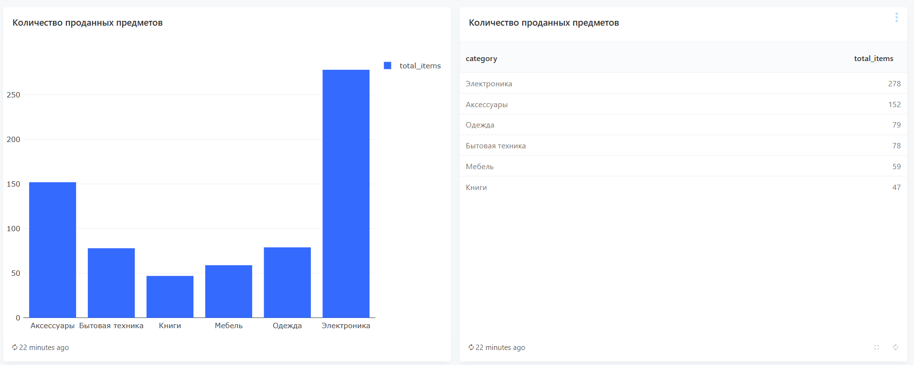
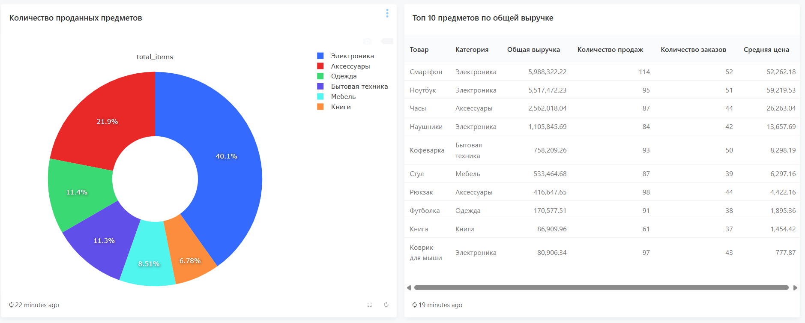
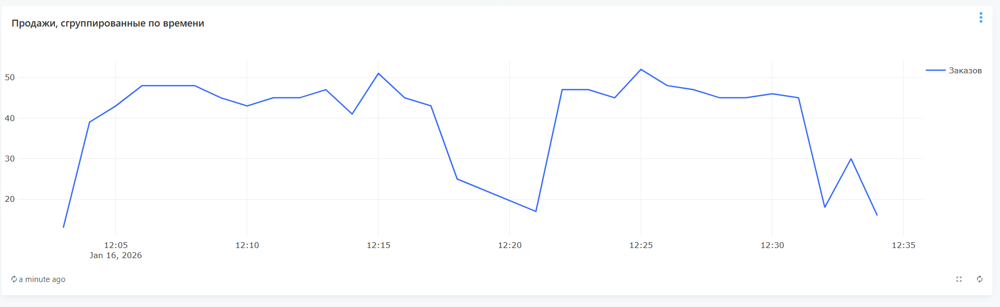

## Data analytics lab

lab for fefu analytics course

## Project overview 
The project simulates part of a encommerce system and provides the following components: 
- Postgre Database
- Python data generator
- Redash (data visualization)
- Docker - for bundling all system components and enabling simultaneous startup.

## Setup
1. Clone the repository to your computer:
```bash
git clone https://github.com/eeetwinkle/data-analytics-lab.git
```

2. Run postgre container with the command:
```bash
docker compose up -d postgre
```

3. Run redash data setup: 
```bash 
docker-compose run --rm redash create_db
```

4. Run all containers with the command: 
```bash
docker compose up -d
```
To run Jupter notebook for analysis, you also need to complete the following steps:
```bash
python -m venv .venv
source .venv/bin/activate
pip install -r requirements.txt
```

When launching Jupyter notebook, select the created environment as the Kernel.

## Dashboard Queries visualization




